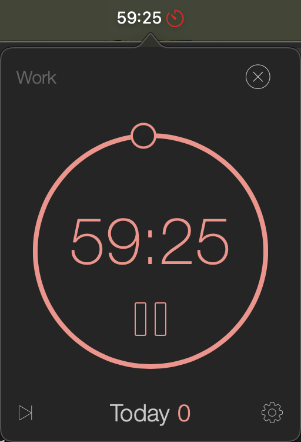
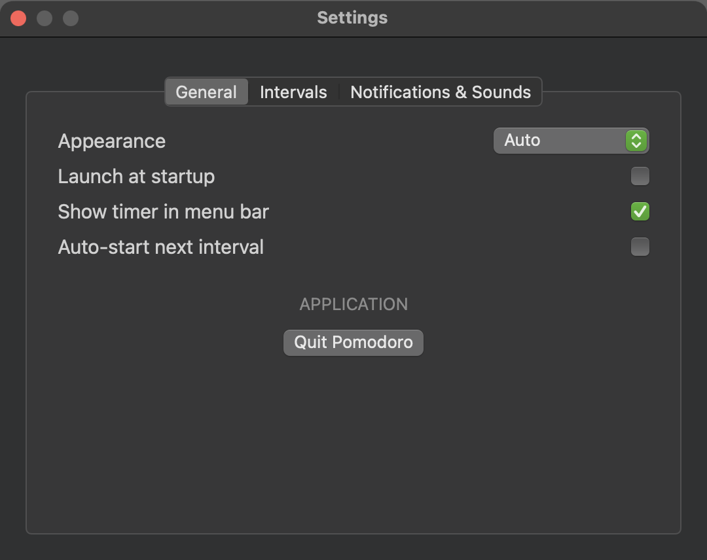
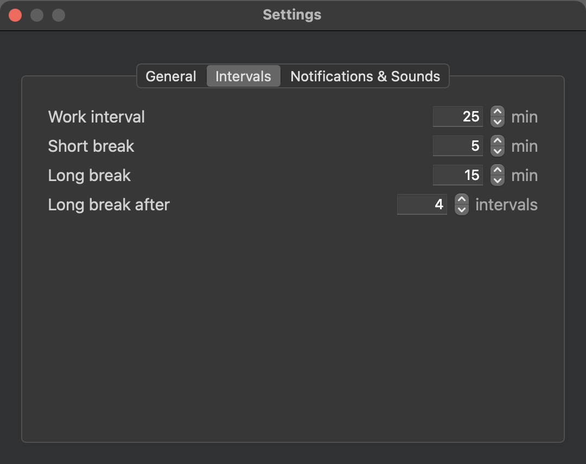
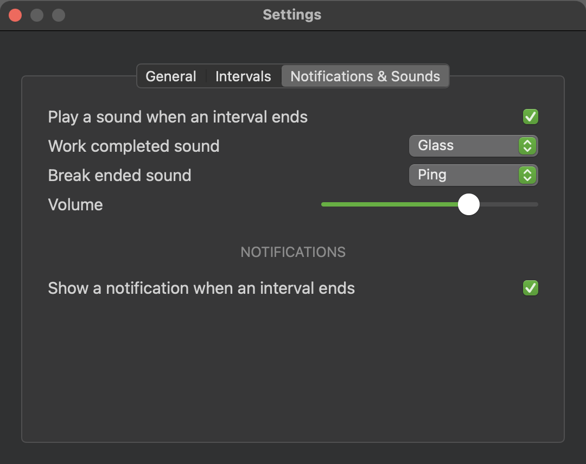

# Pomodoro



A minimal native macOS menu bar pomodoro timer: red while working, green on a
break, grey when stopped. No Dock icon, no main window. Drag the ring to set the
interval (up to 59:59) or click the digits to type it. The ▷| button finishes
work early and counts it — handy when you forgot to start the timer — or skips a
break. Right-click the menu bar icon for the same action, Settings and Quit.

Settings: intervals, the sound and notification at the end of an interval,
launch at startup, and a light/dark/auto appearance.

<p>
  
  
  
</p>

## Run the app (users)

1. Download `Pomodoro.app.zip` from the [latest release](https://github.com/NikolaevMikhailRoma/mac-AppPomodoroSimple/releases/latest) and unzip it.
2. Move it wherever you like (e.g. Applications).
3. First launch: right-click the app → **Open** (it's ad-hoc signed, not notarized by Apple, so Gatekeeper shows one warning before the app even starts — this is expected, click Open to proceed).
4. Once the app launches, macOS will separately ask to allow notifications — allow it if you want the alert when an interval ends. Look for the timer in the menu bar; there is no window.

## Build from source (developers)

All the source is in this repo and safe to review — no third-party dependencies, only Apple's own frameworks.

Requirements:
- macOS 15+
- Xcode Command Line Tools (provides `swift`, `iconutil`, `codesign`) — install with `xcode-select --install` if `swift --version` doesn't work yet

```
git clone https://github.com/NikolaevMikhailRoma/mac-AppPomodoroSimple.git
cd mac-AppPomodoroSimple
./build.sh
open Pomodoro.app
```

Run the unit tests with `swift test` (pure logic lives in the `PomodoroCore` and
`PomodoroConfig` targets). Every colour, size and icon is in
[`config.json`](Sources/PomodoroConfig/Resources/config.json), not in the code.

## Version history

What changed in each version: [CHANGELOG.md](CHANGELOG.md).

- **0.1.1** — ▷| counts a skipped work interval, 59:59 limit with hints, a second copy no longer starts.
- **0.1.0** — first release: menu bar timer, ring, settings, sounds and notifications.

## License

MIT — use it however you like.
